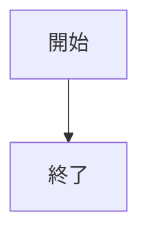
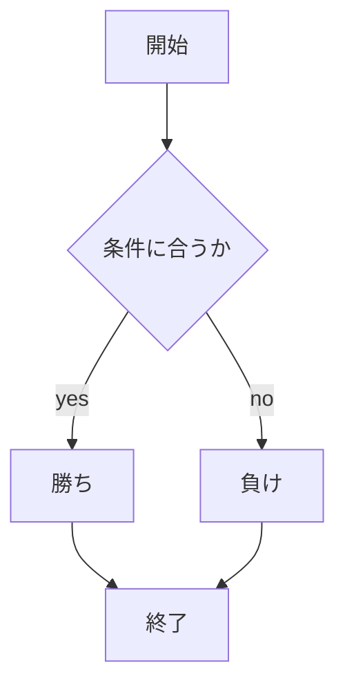
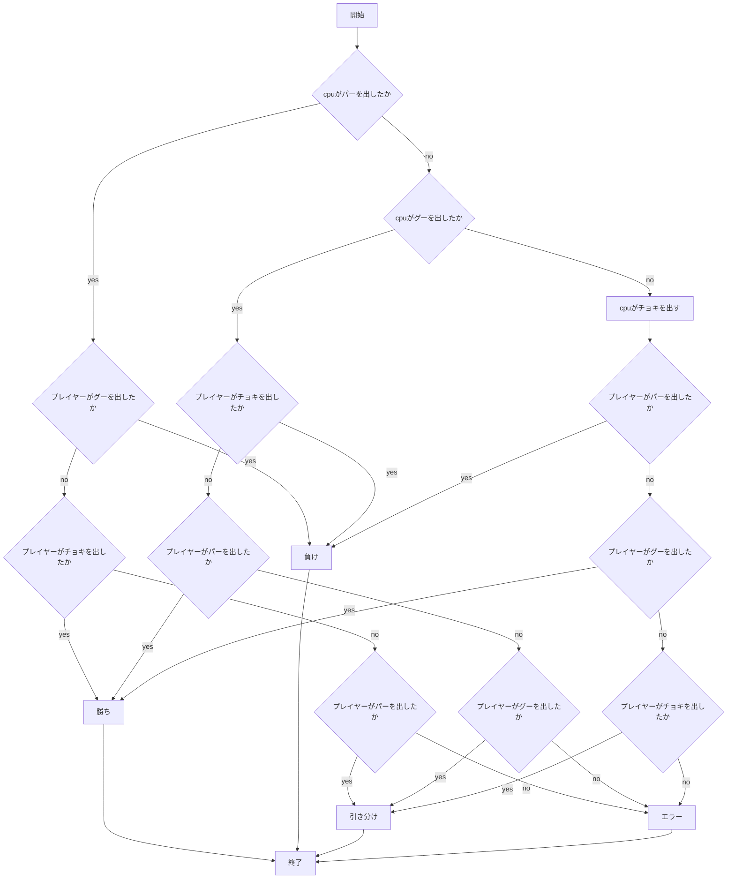
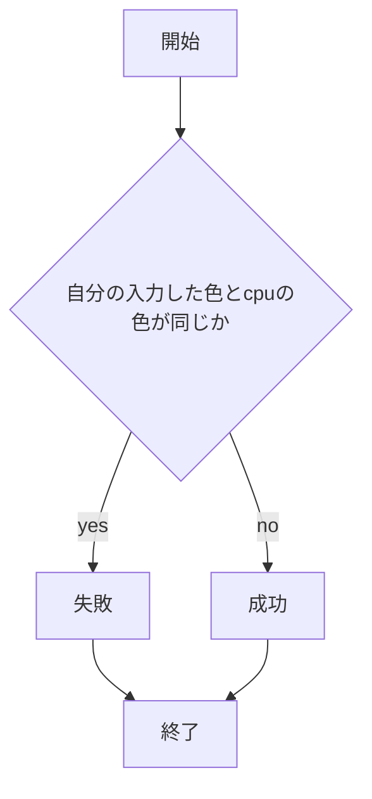
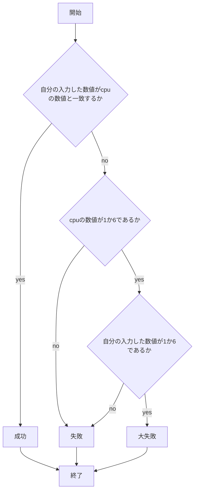

# webpro_06
## このプログラムについて
## ファイル一覧
2024/10/29

```javascript
console.log( 'Hello' );
```






## 課題について
2024/11/18

### 起動方法について
1. ターミナルでcdコマンドを用いてwebpro_06ファイルまで移動する
1. ターミナルで```node app5.js```と打ちポート8080で待ち受けさせる
1. 別のターミナルウィンドウで同様にwebpro_06ファイルまで移動する
1. 移動したウィンドウで```telnet localhost 8080```と打つ
1. 入力できる部分が出現したら```GET /public/(表示したいファイル名).html HTTP/1.1```と打ち改行，さらに```Host:localhost```と打ち2回改行する
### 編集ファイルのGitでの管理方法
1. ターミナルで```$ git add .```と打ち対象を指定する
1. 追記するコメントを```$ git commit -am '入力するコメント'```で記入する
1. Githubを```$ git push```で更新する

### 機能について
#### Show message:hello1について
1. ```node app5.js```を起動する
1. Webブラウザでlocalhost:8080/public/show.htmlにアクセスする
1. 挨拶が表示される

#### Show message:hello2について
基本は上記のと同様だが，こちらはapp5.jsでhello1では変数を代入する形で入れていた挨拶の部分をgreetに直接入れるという形を取っている

#### Iconについて
1. ```node app5.js```を起動する
1. Webブラウザでlocalhost:8080/public/icon.htmlにアクセスする
1. 特定のアイコンが表示される

#### おみくじについて
1. ```node app5.js```を起動する
1. Webブラウザでlocalhost:8080/public/luck.htmlにアクセスする
1. 運勢が表示される

#### じゃんけんについて
ファイル名|説明
-|-
app5.js| プログラム本体
public/janken.html|じゃんけんの開始画面
views/janken.ejs|じゃんけんのテンプレートファイル

1. ```node app5.js```を起動する
1. Webブラウザでlocalhost:8080/public/janken.htmlにアクセスする
1. 自分の手を入力する
1. 入力した手に応じて勝敗が判定され，自分の手，cpuの手，判定，試合数，勝利数が出力される



#### 色被り阻止ゲームについて
ファイル名|説明
-|-
app5.js| プログラム本体
public/kaburuna.html|色被り阻止ゲームの開始画面
views/kaburuna.ejs|色被り阻止ゲームのテンプレートファイル

1. ```node app5.js```を起動する
1. Webブラウザで```localhost:8080/public/kaburuna.html```にアクセスする
1. 自分の色を入力する
1. 入力した色に応じて色が同じかどうか判定され，自分の色，cpuの色，判定，挑戦回数，成功数が出力される



#### 数字運試しについて
ファイル名|説明
-|-
app5.js| プログラム本体
public/fortune.html|数字運試しの開始画面
views/fortune.ejs|数字運試しのテンプレートファイル

1. ```node app5.js```を起動する
1. Webブラウザで```localhost:8080/public/fortune.html```にアクセスする
1. 任意の数値を入力する
1. 入力した値に応じて数値が同じかどうか判定され，自分の数値，cpuの数値，判定，挑戦回数，成功数が出力される

