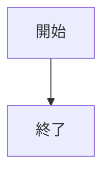
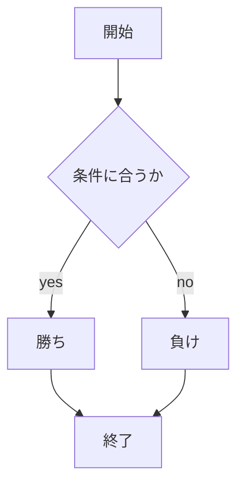
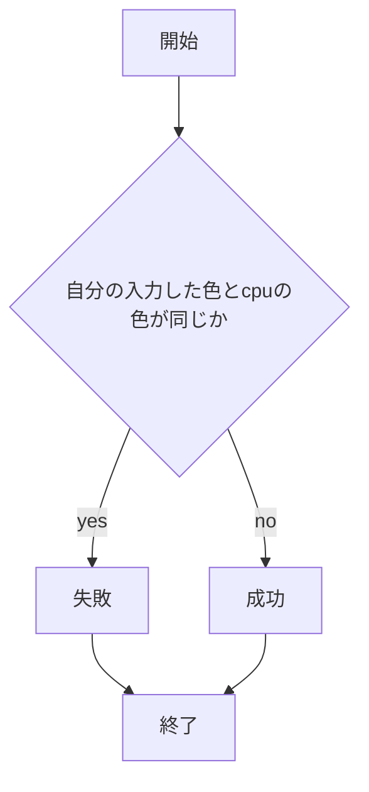

# webpro_06
## このプログラムについて
## ファイル一覧
2024/10/29

ファイル名|説明
-|-
app5.js| プログラム本体
public/janken.html|じゃんけんの開始画面
views/janken.ejs|じゃんけんのテンプレートファイル


```javascript
console.log( 'Hello' );
```

1. ```node app5.js```を起動する
1. Webブラウザでlocalhost:8080/public/janken.htmlにアクセスする
1. 自分の手を入力する






## 課題について
2024/11/18

(起動方法の説明記載)
(編集ファイルの管理？記載)

### 色被り阻止ゲームについて
ファイル名|説明
-|-
app5.js| プログラム本体
public/kaburuna.html|色被り阻止ゲームの開始画面
views/kaburuna.ejs|色被り阻止ゲームのテンプレートファイル

```javascript
(多分コード記載)
```

1. ```node app5.js```を起動する
1. Webブラウザで```localhost:8080/public/kaburuna.html```にアクセスする
1. 自分の色を入力する



### トランプのカード生成について
ファイル名|説明
-|-
app5.js| プログラム本体
public/kaburuna.html|トランプのカード生成の開始画面
views/kaburuna.ejs|トランプのカード生成のテンプレートファイル

```javascript
(多分コード記載)
```

1. ```node app5.js```を起動する
1. Webブラウザで```localhost:8080/public/cards.html```にアクセスする
1. 任意の数値を入力する

